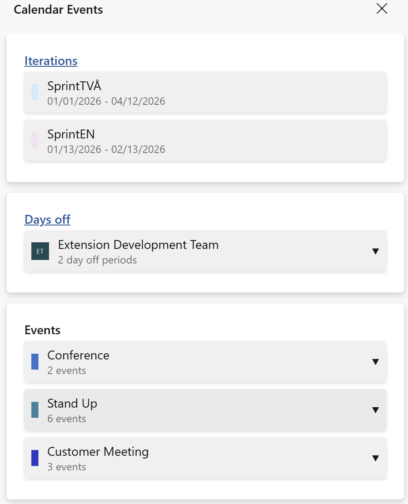
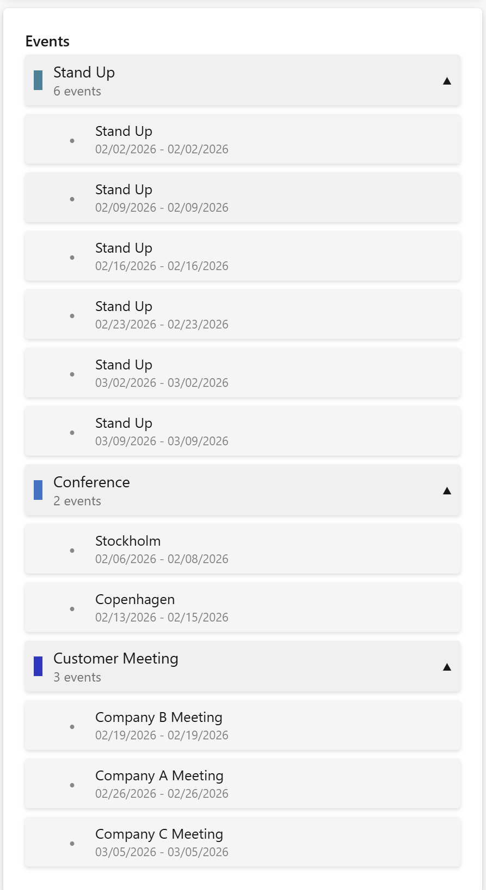
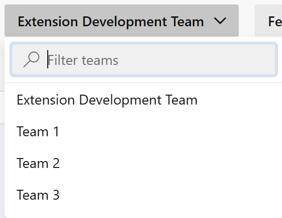
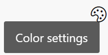
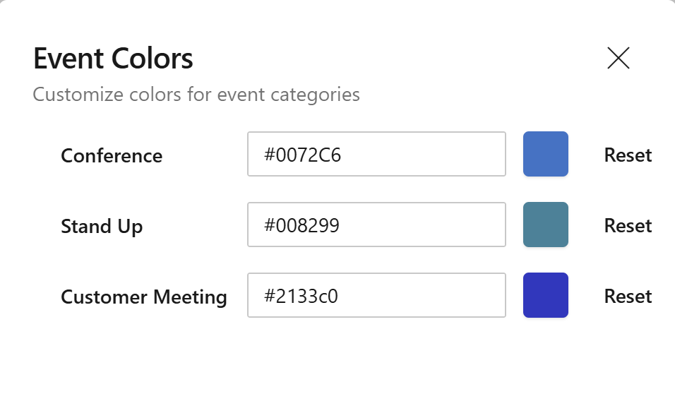
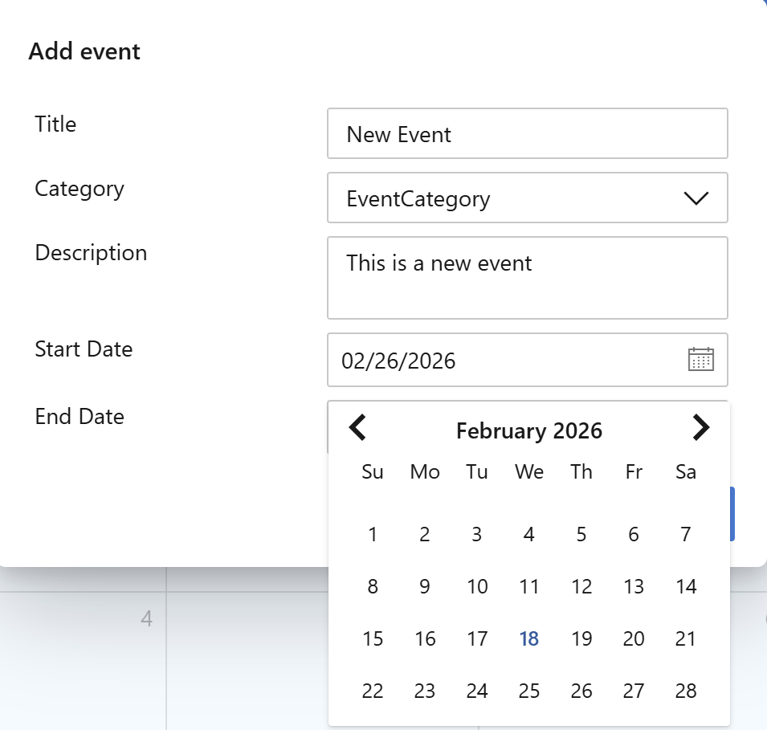

# Calendar Extension - What's New

This document outlines the new features and improvements made in the side panel changes update.

## Side Panel UI Improvements

The side panel has received a complete visual overhaul with a modern, clean design that better integrates with Azure DevOps.

### Enhanced Summary View

The Calendar Summary panel now features:
- **Improved card design** - Cleaner, more organized cards for Iterations, Days Off, and Events
- **Better spacing and layout** - More breathing room between elements for improved readability
- **Responsive display** - Automatically adjusts the number of items shown based on available screen space
- **Show more/less controls** - Expandable sections when you have many items (automatically displays 5-25 items based on screen height)

### Organized Event Categories

Events are now grouped by category for easier navigation:
- **Collapsible category sections** - Click to expand or collapse event groups
- **Category indicators** - Visual color coding for each event category
- **Event counts** - See how many events are in each category at a glance

### Collapsible Sidebar

The side panel can now be collapsed to give you more screen space for viewing your calendar:
- **Toggle button** - Easily show or hide the summary panel with a single click
- **Persistent state** - The panel remembers whether you had it open or closed
- **More calendar space** - Collapse the panel when you need to focus on the calendar view
- **Smooth transitions** - Panel slides in and out smoothly

## Searchable Teams

Finding and switching between teams is now much easier with the new team search functionality.

### Team Search Feature

- **Quick search** - Start typing to instantly filter your teams
- **Large team support** - Easily navigate through dozens or hundreds of teams
- **Keyboard navigation** - Use arrow keys and enter to select teams quickly
- **Clear visual feedback** - See which team is currently selected

## Event Color Customization

You can now customize the colors of your event categories to match your preferences or team conventions.

### Access Color Settings

- Open the color settings from the header menu
- Modify colors for any existing event category
- Changes apply immediately to all calendar views after saving

### Color Settings Panel

A new color customization feature lets you:
- **Choose custom colors** - Pick any color for each event category
- **Visual color picker** - Use an intuitive color picker or enter hex codes directly
- **Live preview** - See color swatches before applying changes
- **Reset to defaults** - Easily revert colors to their default values
- **Persistent settings** - Your color choices are saved and applied across sessions

## Dialog Improvements

Both event and days off dialogs have been updated with better usability.

### Modern Date Picker

Date selection is now easier with:
- **Calendar widget** - Click the calendar icon to open an interactive date picker
- **Direct input** - Type dates directly in MM/DD/YYYY format
- **Visual feedback** - Clear indication of selected dates
- **Better keyboard navigation** - Improved accessibility for keyboard users

## Visual Polish

Multiple visual refinements throughout the extension:
- **Consistent styling** - Unified design language across all components
- **Smooth animations** - Subtle transitions when expanding/collapsing sections
- **Better contrast** - Improved text readability
- **Modern color palette** - Updated colors that align with Azure DevOps design system
- **Icon improvements** - Crisper, more consistent icons

## Summary

This update focuses on improving the user experience with a refreshed side panel design, customizable event colors, more intuitive date selection, and better team navigation. The collapsible sidebar gives you more flexibility in how you view your calendar, while the searchable teams feature makes it easy to switch between teams in large organizations. All changes maintain full compatibility with existing functionality.
